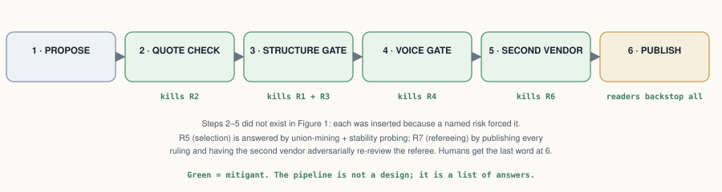

# Verification-First Knowledge Extraction from Interpretive Corpora: A Methodology with Measured Error Bars, Demonstrated on C. G. Jung's Collected Works

**Damian Spendel**
*AI collaborators: Claude Opus 4.8 (extraction), Claude Fable 5 (independent verification & audits), orchestration via Claude Code (Anthropic). Roles in §3 and the Authorship Note.*

*Draft v2.0 (arXiv-track) — 27 July 2026 · Artifact: [symbolicworld.observer](https://symbolicworld.observer) · Dataset & ledger: project repository, release `v1.0-cw14`+*

---

## Abstract

**This paper's contribution is primarily a methodology — and secondarily the verified dataset it produced.** Language models extract knowledge-graph facts at 30–66% accuracy and hallucinate 11–57% of citations in deployed systems; for scholarship, that is unusable. We build a knowledge graph of C. G. Jung's *Collected Works* — 233 concepts and symbols, 634 relations, 659 references, each anchored to a numbered paragraph with a verbatim quote of at most 25 words — under one rule: **no claim is published until it passes a mechanical check that its quote exists in the cited paragraph, an independent review by a model from a different family than the proposer, and an audit by a model from a different vendor.** Every reference is also typed by rhetorical voice — Jung's own claim, doctrine he reports, or a source he quotes — because voice confusion is the error that dominated every audit we ran (E2–E3, E6–E7). We measure the pipeline rather than ask anyone to trust it. Five numbers carry the result: unverified extraction ran at a **~25% flaw rate** on this corpus; the calibrated verifier catches **86% of deliberately seeded corruptions** (95% CI 78–91%) while wrongly flagging at most 7% of clean items; an adversarial audit of published references found **zero content errors**; a full-volume audit by a second vendor, judging in its own words, upheld a **1.0% residual error rate** — none of them fabrications or reversals; and the marginal cost is **$0.09–0.12 per verified citation**. All error rates, corruption seeds, and adjudications are published with the artifact (a plain-language guide to the statistics is included). The trust chain ends in humans, not models: every edge carries a check-it-yourself pointer, and live dispute and confirmation channels feed a public per-edge verification log. The machines do the hard yards; human judgement has the last word.

## 1. Opportunity

Every field has corpora like this: twenty volumes of an author arguing, quoting, and reporting — where what the author *said*, on *whose authority*, at *exactly which place*, is the scholarly currency. Law has its judgments, philosophy its systems, history of science its debates. Our running example is C. G. Jung's *Collected Works*: twenty volumes that run to twenty volumes of densely cross-referential prose in which the same symbol (Mercurius, the lion, salt, Luna) carries systematically different meanings by context and authority. The digital tools that exist are lexical — the [ARAS concordance](https://aras.org/concordance) indexes word occurrences; Princeton's digital edition searches full text — but no resource answers the question a reader actually has: *what does Jung say the green lion **is**, and on whose authority?*

Large language models make the answer look easy, and cheap: an AI reads the volumes, drafts the claims, and a public atlas appears for about ten cents a claim (Figure 1).

*Figure 1 — The opportunity: let the machines do the hard yards. This is also, unguarded, exactly what current tools do — and the rest of this paper is about why that is not good enough and what to do instead.*

This paper's shape, stated up front: **the naive pipeline has named risks (§2, with the literature that documents them in §3); for every risk we inserted a mitigation into the pipeline (§4); for every mitigation we ran an experiment to test whether it works (§5–6); §7 tables what risk remains; §8 what we haven't done; §9 what we learned.** One design choice runs through everything: the trust chain is built to end in humans, not models — because a chain of models, however cross-checked, cannot certify itself. Honest status today: the machine part is complete and measured; the human part is live as channels, with accumulated human verification still small.

## 2. Risks

Reading is where the danger is. When a model turns prose into claims, seven things can go wrong — five in the reading itself, two in any machinery you build to catch them (Figure 2):

- **R1 — the statement is wrong or invented.** The model asserts something the text does not say.
- **R2 — the quote is fabricated.** The supporting quotation does not exist in the cited paragraph.
- **R3 — the meaning is wrong.** Right ingredients, wrong dish: direction reversed, wrong object, "is" where the text says "is like".
- **R4 — the context is wrong.** The claim is real but the *voice* is misassigned: the author's own view (*author-asserts*), doctrine the author reports (*author-reports*), or a source the author quotes (*author-quotes*) — and how firmly it is said. (In Jung: is this his psychology, or the alchemists' doctrine he is describing?)
- **R5 — the selection is arbitrary.** Why these claims and not others? A different run might paint a different picture.
- **R6 — the checkers share blood with the writer.** If proposer and verifier come from one vendor, they may share blind spots that no one inside the loop can see.
- **R7 — the referee is one of ours.** When checkers disagree, some judge must rule — and if that judge is also our model, it is marking its own homework.

*Figure 2 — The same naive pipeline, with its risks made visible. R1–R5 arise at the reading step; R6–R7 arise from the fix itself.*

## 3. Related Work

The risks above are documented, not hypothetical:

**LLM KG extraction.** [KGGen](https://papers.neurips.cc/paper_files/paper/2025/file/2b368455e832d2b1a60bcad8c4c6481f-Paper-Conference.pdf), GraphRAG, OpenIE establish unverified accuracy baselines (30–66%); [schema-aware triple verification](https://arxiv.org/pdf/2604.04190) and prover–skeptic [dialogue approaches](https://arxiv.org/pdf/2603.06974) add post-hoc verification. We differ in making verification a *mandatory publication gate*, grounding it in the full source paragraph, and calibrating the verifier itself with seeded corruptions.

**Attributed generation.** Verbatim-evidence systems (FullCite / [structured inline citation](https://arxiv.org/html/2606.07130), Quote-Tuning) enforce quotation at generation time; we enforce it at dataset level as a hard deterministic check, independent of any model.

**LLM-as-judge reliability.** [Self-preference bias](https://www.researchgate.net/publication/385353198_Self-Preference_Bias_in_LLM-as-a-Judge) (measured −38% to +90%) and [debiasing work](https://arxiv.org/pdf/2508.09724) motivate our hard constraint that proposer and verifier come from different model families; our seeded-corruption calibration (§6.2) is, to our knowledge, the first published sensitivity/specificity measurement of a verification gate in a humanities KG setting.

**Industry practice.** Production extraction pipelines converge on the same skeleton independently: schema-first design, typed mechanical validation with human escalation carrying the best-effort extraction ([production document-pipeline lessons](https://medium.com/alan/lessons-from-running-an-llm-document-processing-pipeline-in-production-33d87f99cdb1)), continuous calibration of automated judges against sampled expert judgment ([HITL evaluation practice](https://www.braintrust.dev/articles/best-human-in-the-loop-llm-evaluation-platforms-2026)), and verification loops with measured diminishing returns after ~2 rounds ([verification-loop patterns](https://timjwilliams.medium.com/llm-verification-loops-best-practices-and-patterns-07541c854fd8)). Dedicated KG fact-verification agents ([AgentKGV](https://arxiv.org/html/2607.09092)) treat verification as a first-class subsystem. Our pipeline is the documented, measured instance of this consensus applied end-to-end to an interpretive humanities corpus — orthodox where it should be (cross-model judging, staged validation, audit artifacts), novel where it counts (publication-gating, seeded-corruption calibration of the judge itself, per-axis specialist decomposition, rhetorical-voice provenance).

**What we borrowed.** The reference format adapts the assertion/provenance/publication-info anatomy of [nanopublications](https://arxiv.org/pdf/1809.06532) (a native serialization is planned). Nanopublications have seen almost no humanities uptake — their ~10.8M published instances are overwhelmingly life-science data — and this project is evidence that they deserve consideration as a publishing form for the humanities: the atomic unit of a nanopublication (one claim, its exact source, who stands behind it) matches what a humanities footnote has always tried to be, and the voice dimension interpretive corpora add fits naturally in its provenance graph. And the voice-typing treats provenance as *epistemic stance* in the sense of [provenance-enhanced statements](https://arxiv.org/html/2606.15246) — our stubborn "sympathetic reportage" residual is precisely their claim-in-permeation between cognitive worlds. The nearest existing artifact is the [Darshana Graph](https://arxiv.org/abs/2606.18222), whose author names a randomly sampled precision evaluation "the most valuable immediate extension" of that work — this paper operationalizes exactly that extension, with the caveat that our annotators are so far models from two vendors rather than multiple humans (human in the loop live as a channel, §8). No knowledge graph of Jung's Collected Works previously existed; the ARAS concordance and Princeton's digital edition are search, not relations.

## 4. Mitigants

Each risk in §2 forced a step into the pipeline. Figure 3 shows the result: the two-box dream of Figure 1 with four inserted checks, plus practices for the two risks that don't fit in a box.

*Figure 3 — Steps 2–5 did not exist in Figure 1; each was inserted because a named risk forced it (green tags name the risk each step mitigates).*

**Table 1 — the pipeline, step by step, and the risk each step mitigates.**

| Step | What it does | Mitigates | What comes out |
|---|---|---|---|
| 1 · Propose | A proposer model reads a window of the corpus and drafts candidate claims, each with a verbatim quote and its anchor, typed *author-asserts / author-reports / author-quotes* | — (the risks arise here) | 12–22 candidates per window |
| 2 · Quote check | Deterministic: the quote must appear in the cited passage as a letter-normalized, in-order, near-contiguous token run (bounded gaps absorb interleaved footnote markers; collage quotes rejected, canary-guarded) | **R2** | candidates with real quotes |
| 3 · Structure gate | A reviewer model **from a different family** reads the full passage: is the claim there, right way round, right object, no inflation of analogy into identity? | **R1 · R3** | SUPPORTED / PARTIAL + correction / WRONG |
| 4 · Voice gate | A second, narrow review: whose claim is it, and how firmly is it made? | **R4** | voice + hedge corrections |
| 5 · Second-vendor check | A model **from a different vendor** re-judges the batch, blind | **R6** | independent verdicts, disagreements adjudicated |
| 6 · Publish | Corrections applied; WRONG dropped and logged; provenance stamped; integrity tests + canaries; build **fails closed** on any unverified reference; readers confirm/dispute | backstop for all | the public artifact |

R5 (arbitrary selection) is mitigated by practice rather than a step — union-mining plus stability probing; R7 (self-refereeing) by publishing every ruling and the auditor's adversarial re-review of the referee.

Every batch's passage through these steps is committed to a **transaction ledger**, one commit per transition — the construction history is replayable and auditable commit-by-commit.

**The cross-vendor loop.** Beyond the per-batch check, the second-vendor auditor re-audits the published graph — and the machinery itself — **at every dataset release** (two full runs so far, E6 and E7; this is a release-gated commitment, not a background process): it judges samples blind (in two modes: under our rubric for comparability, or entirely in its own terms for independence), every disagreement is adjudicated against the source passage with the ruling logged, the auditor then **adversarially re-reviews the adjudicator's rulings** (the conflict-of-interest control), and finally it critiques our gate prompt itself for bias. Audit findings re-enter the same merge machinery as ordinary batch verdicts — there is no separate, weaker path into the graph.

## 5. Risk Measurement

Every mitigant gets measured, by a small set of reusable experiment designs — none of them corpus-specific:

- **Retro-verification** — run the gates over output that was published *without* them: measures the raw risk the pipeline exists to remove.
- **Seeded-corruption calibration** — deliberately break known-good entries (reverse a direction, swap an object, inflate an analogy, flip a voice), hide them among clean ones, and count what each gate catches: turns "we have a verifier" into "we have a verifier with a measured catch rate per error type."
- **Adversarial audit** — instruct a reviewer to *break* each published claim: measures what survived the gates.
- **Independent re-extraction** — re-run the proposer blind on an already-mined window: measures whether the selection is stable or arbitrary.
- **Cross-vendor audit, two modes** — a different vendor's model re-judges published samples, once under our rubric (comparable) and once entirely in its own terms (independent): measures shared blind spots, and whether the rubric itself steers verdicts.
- **Standing self-tests** — corruption canaries the validators must catch on every run, and the human confirm/dispute channels on every published claim.

Figure 4 pins each design to the pipeline step it measures. Results for the Jung case study are consolidated in Table 3 (§10); per-experiment details are in Appendix A.

*Figure 4 — Blue chips name the experiment that measures each step, with a one-line legend for each experiment. No box is taken on faith.*

## 6. Case Study: Jung's Collected Works

**Corpus.** Paragraph records `{volume, §, text, page}` extracted mechanically from epub markup (§ numbers read from bracketed markers, strictly ascending; never inferred), with a §→Bollingen-page concordance. The corpus stays local; only ≤25-word verified quotes are published (legal basis: `docs/LEGAL.md`).

**Roles.** Proposer: Claude Opus 4.8 (Anthropic). Structure and voice gates: Claude Fable 5 (Anthropic — different family from the proposer). Second-vendor auditor: Gemini 3.1 Pro (Google). Orchestration: Claude Code, under the author's direction. The graph built before the cross-vendor stage existed was audited retroactively — a stratified sample under the shared rubric (E6) and a full volume rubric-free (E7) — which is what validated promoting that check from experiment to pipeline stage; at ~a tenth of a cent per citation there is no economic reason to leave it post-hoc.

**Schema.** Nodes `{id, type ∈ {Concept, Operation, Symbol, Figure, Substance, Motif}, label}`; edges `{subject, relation (open vocabulary, verbatim-faithful), object, references[]}`; references `{volume, §, quote, claim_type, source?, confidence, verified, verified_by, verified_date}`.

**Instantiation.** The generic voice vocabulary becomes `jung-asserts` / `jung-reports-parallel` / `jung-quotes-source` (+ named source). Current state: **233 nodes · 634 edges · 659 references** across 468 distinct paragraphs of nine CW volumes; CW 14 covered end-to-end; 438 asserts / 160 reports / 61 quotes-source over 74 named sources; 84 hedged (medium-confidence) references; 100% gate-verified with per-reference verifier and date.

**The artifact.** The public Atlas ([symbolicworld.observer](https://symbolicworld.observer)) renders the graph in six typed regions with search and walkable citations. Every citation expands to its verification record — claim type, source, confidence, verifier, date, and a check-it-yourself pointer to the exact § and Bollingen page — so refutation needs only the printed edition and about two minutes. Two gated reader channels close the loop: **dispute** (a prefilled report to the public issue tracker; admissible disputes are re-judged with the objection attached; outcomes published in the verification log and linked from the edge) and **confirm** (reader confirmations enter the edge's public record as human-in-the-loop provenance). Accumulated upheld disputes above the published error bar would falsify the pipeline claim itself, not just individual edges.

**What the measurements say about Jung.** The residual error class is not noise — it maps a real property of the text. Every model configuration, across two vendors, fails on the same items: passages where Jung reports alchemical or Gnostic doctrine *and half-adopts it*. That "sympathetic reportage" boundary resists the three-way voice taxonomy because Jung's own voice is genuinely blended there — a finding about the Collected Works, not just about models, and the precise place where human judgement (and Jungian scholarship) is required.

## 7. Residual Risks

Table 2 answers one question: **of the risks in §2, what remains after the mitigations of §4, measured by the experiments of §5 (details: Appendix A)?** (A 16-item assumptions register is published in `docs/ASSUMPTIONS.md`.)

**Table 2 — residual risks.**

| # | Risk | Mitigation in force | Evidence / data | Residual |
|---|---|---|---|---|
| i | **Shared-substrate risk** — proposer and verifier share one vendor; correlated blind spots invisible to both | Proposer and verifier from different families; a second-**vendor** check in the pipeline and at every release (E6–E7) | 0 unsupported edges (n=100); 1.0% upheld residual (n=407); both vendors miss the *same* voice items → text ambiguity, not vendor blind spot | Low; one second vendor |
| ii | **Single translation** — quotes are Hull/Bollingen-bound | § anchors are edition-stable; documented as assumption #1 | — | German *GW* cross-check deferred (§8) |
| iii | **Salience sampling** — "strongest relations" per window, not exhaustive parse | Stability probe; union-mining; claim-coverage framing (§6.6) | E4: independent re-extraction recovers core claims (37.5% strict pair overlap, theses stable); union batch: 13/20 re-findings | Tier-2 claims sampled, not complete |
| iv | **Calibration scope** — sensitivity measured only on four seeded corruption classes | Classes chosen from observed production errors; expanded to n=200 | E1b: 86% (CI 78–91%) / 93% spec; per-class 72–96% | Unknown error types unmeasured, by construction |
| v | **Single-paragraph judging context** — cross-paragraph claims can be mis-scored | Documented; flagged cases adjudicated case-by-case | E7: 2 of 10 moderate flags were cross-paragraph context cases (both-defensible) | Standing; a windowed-context gate would cost ~2× |
| vi | **Adjudication discretion** — the orchestrator (an Anthropic model) rules on disputes | All rulings published verbatim; adversarial cross-review by the second vendor | E6: cross-review accepted 9/11 rulings and forced 2 stronger corrections | Cross-review is one round; full independence awaits the human tier |
| vii | **Shared-rubric convergence** — agreement partly an artifact of handing the auditor our rubric | Rubric-free replication mode (E7) | Identical detection profile with and without rubric; 95% cross-mode verdict consistency | Measured ≈ zero on tested classes |
| viii | **Human in the loop still thin** — channels live, accumulated human data ≈ zero | Confirm/dispute channels shipped; community pilot planned (§8) | Channels e2e-tested; 0 reader confirmations to date (stated plainly) | The main open gap — see §8 |

## 8. Limitations

Where §7 quantifies what remains of the *named* risks, this section lists the boundaries the experiments never touched.

Coverage beyond CW14/CW12 is thin; eleven volumes untouched. The relation vocabulary is open (single-use relations pending a relation-family layer). The cross-vendor stage is implemented and standing (E6–E7; pre-publication for all future batches, §3); what remains is only its ongoing cadence commitment as the graph grows. Planned: **(a) expanded specialist calibration** — the E5 voice-specialist sample is still small (n=6 per axis) and the specialist-advantage claim awaits statistical resolution; **(b) community verification** — blind review by Jungian readers with the evidence view as instrument, human–machine κ published, human confirmations entering the per-edge provenance chain (protocol in `docs/ASSUMPTIONS.md` §E); **(c) a declarative verifier registry** — each verification stage defined as configuration (model, axis, prompt, output schema, and its own calibration set with last measured sensitivity/specificity) over one shared runner and verdict-applier, making specialist decomposition an operable pattern rather than a finding: a new corpus axis becomes a registry entry, and every stage's quality is attached, re-measurable data; **(d) German *Gesammelte Werke* cross-check; (e) DOI-registered dataset releases, including a native nanopublication serialization of the graph (each reference already carries the assertion/provenance/publication-info anatomy, §2); (f) explicit permeation markers for sympathetic reportage, adapting the DEC cognitive-worlds semantics (§2) to replace the informal confidence downgrade.**

## 9. Imperatives

1. **Ensure extraction is verified — the checking is the product.** A quarter of unverified extractions were flawed; after gating, adversarial audits find zero content errors.

2. **Know the two kinds of mistakes — machines only catch one well.** *Shape* mistakes — who does what to whom: wrong direction, wrong object — are caught almost every time (92–96% in calibration). *Voice* mistakes — who is speaking: Jung himself, or the alchemists he is describing — are caught only about three times in four. So nearly everything that slips through is a voice mistake. Like proofreading: the spellchecker catches spelling nearly perfectly; whether a sentence is sincere or sarcastic survives it.

3. **Voice is genuinely hard — for machines and probably for people.** "Sympathetic reportage" — doctrine Jung reports *and* half-adopts — resists a clean three-way label; every model configuration we tested, across two vendors, missed the same borderline items.

4. **Teach the miner — fold the gate's corrections back into its instructions, not its weights.** When the verifier corrects a batch ("you typed reported doctrine as Jung's own claim"), those corrections are folded into the *next* batch's extraction instructions as explicit rules and examples. The extraction model never changes; its briefing does. Result: error flags fell from 18.9% on the oldest batches to 5.6% on the newest, and recent batches pass 20/20.

5. **Specialize the checkers — one measured weak axis each.** A checker given five things to check does the obvious ones well and the subtle one poorly; given one thing, it does that one well. The same model that caught 40–72% of voice errors as a five-criteria generalist caught 5/6 as a single-axis specialist, and the same improvement appears with the other vendor's model (2/6 → 4/6). The expanded calibration narrowed the measured gap, so we state this as directionally consistent across four measurements, pending larger samples.

6. **Measure coverage in claims, not pages — the graph is accurate, not exhaustive.** It cites 34% of CW 14's paragraphs, yet independent re-extraction recovers each chapter's core claims (E4) — because most paragraphs argue, illustrate, or amplify rather than assert a new relation. Like a topographic map, it is complete above a chosen prominence, not in every hill; union-mining lowers that threshold at ~$2 per window.

7. **Make trust inspectable.** Per-citation verification records, published error rates, self-testing validators, and live dispute/confirmation channels convert "trust us" into "check us."

## 10. Summary of Results

**The compounded result, in one sentence: raw AI extraction on this corpus gets roughly one claim in four wrong; after the pipeline, an independent vendor auditing a full volume in its own words could uphold errors in one claim in a hundred — a ~25-fold error reduction, with every surviving error a nuance of attribution rather than a fabrication or reversal, at about ten cents per verified claim, and every claim checkable by any reader in about two minutes.**

The funnel: ~25% flawed (E0, ungated) → fabrication eliminated (quote check) → structure errors caught at 92–96% (E1b) → voice swept graph-wide (E3) → independently re-audited across vendors → **1.0% upheld residual (E7), none of it fabrication**. Table 3 decomposes this row by row.

**Table 3 — pipeline step · risk · mitigant · experiment · headline result.**

| Pipeline step | Risk | Mitigant | Experiment | Headline result |
|---|---|---|---|---|
| 1 · Propose | R1 wrong/invented statements | never publish raw — everything below | E0 | unchecked extraction: ~25% flawed |
| 1 · Propose | R5 arbitrary selection | union-mining; claim-coverage framing | E4 | independent re-extraction finds the same core claims |
| 2 · Quote check | R2 fabricated quotes | deterministic verbatim match | canaries | fabrication eliminated; 5 planted corruptions must be caught on every test run |
| 3 · Structure gate | R3 wrong meaning | independent model family reads the full paragraph | E1b | 86% of planted errors caught (CI 78–91%); 92–96% on structure |
| 4 · Voice gate | R4 wrong context | narrow specialist on the measured weak axis | E5 · E3 | graph-wide sweep fixed 10.3%; specialist directionally better, larger n pending |
| 5 · Second vendor | R6 shared blind spots | Gemini re-judges — with our rubric and without | E6 · E7 | 0 unsupported /100; 1.0% residual /407; rubric effect ≈ 0 |
| (refereeing) | R7 marking own homework | rulings published verbatim; second vendor re-reviews the referee | in E6 | 9/11 rulings upheld; 2 stronger corrections forced on us |
| 6 · Publish | whatever still got through | adversarial audit; evidence views; reader confirm/dispute | E2 · humans | 0 content errors in 30; human data accumulating (early) |

*A second-corpus column is planned: the same harness run on a public-domain corpus (William James, __The Varieties of Religious Experience__), yielding a per-corpus risk profile alongside Jung's — and a fully distributable reproduction package.*

## 11. Conclusion

This paper does not claim the graph is correct. It claims something a reader can actually use: **the graph's error rate is known (~1% by independent audit), small, named (voice nuance, not fabrication), and checkable** — by another AI vendor, and by any reader with the book and two minutes. That is what the methodology manufactures: not correctness, but *quantified, inspectable trust*. Whether that is robust enough for scholarly use is a judgment the reader is now equipped to make — which is the point. The machines did the hard yards: extraction, checking, cross-checking, and the bookkeeping of every correction. Human judgement keeps the last word: in the adjudications, in the dispute and confirmation channels, and eventually in a community of readers. Nothing in the method is Jung-specific — any authored corpus where *who said what, exactly where* is the scholarly currency is a candidate, at roughly $0.10 per verified claim.

---

---

---

### Authorship note

Conception, direction, corpus provision, publication decisions, and final responsibility: **Damian Spendel**. Edge proposal: *Claude Opus 4.8* (Anthropic). Independent verification, audits, calibration runs: *Claude Fable 5* (Anthropic). Cross-vendor auditing, adjudication cross-review, and prompt-bias critique: *Gemini 3.1 Pro* (Google). Orchestration, tooling, experiments, drafting: *Claude Code* (Anthropic), under the author's instruction. Proposer/verifier family separation — and the second-vendor audit tier — are deliberate design constraints.

**Artifact availability.** Dataset, pipeline code, transaction ledger, all experiment inputs/verdicts/adjudications, and this paper: [github.com/damianspendel/symbolic-world](https://github.com/damianspendel/symbolic-world) (public; the issue tracker is the standing dispute channel described in §4). Live atlas: [symbolicworld.observer](https://symbolicworld.observer).

### Key references

- [KGGen (NeurIPS 2025)](https://papers.neurips.cc/paper_files/paper/2025/file/2b368455e832d2b1a60bcad8c4c6481f-Paper-Conference.pdf) · [RAG vs GraphRAG](https://arxiv.org/pdf/2502.11371)
- [Attribution, Citation, and Quotation: A Survey](https://arxiv.org/html/2508.15396v1) · [Cited but Not Verified](https://arxiv.org/pdf/2605.06635)
- [Self-Preference Bias in LLM-as-a-Judge](https://www.researchgate.net/publication/385353198_Self-Preference_Bias_in_LLM-as-a-Judge) · [UDA](https://arxiv.org/pdf/2508.09724)
- [Structured Inline Citation Generation](https://arxiv.org/html/2606.07130) · [Schema-Aware Triple Verification](https://arxiv.org/pdf/2604.04190) · [Prover–Skeptic KB Generation](https://arxiv.org/pdf/2603.06974)
- [Nanopublications](https://arxiv.org/pdf/1809.06532) · [Provenance-Enhanced Statements](https://arxiv.org/html/2606.15246)
- [KGs in Libraries & Digital Humanities](https://arxiv.org/abs/1803.03198) · [ARAS Concordance](https://aras.org/concordance)

## Appendix A — Experiment details

**Risk 1 — raw AI extraction can't be trusted.** *Mitigation: never publish raw extraction. Test: measure how bad it actually is.*

**E0 — Retro-verification of ungated extraction (n=238).** Everything mined before the gate became mandatory was re-checked by the standard gate: 178 confirmed, 54 corrected, 6 edges deleted — a **25.2% flaw rate for unverified LLM extraction** on this corpus, consistent with public benchmarks. Dominant classes: voice conflation, identity overreach, referent drift, direction reversal; deletions included a spliced quote and a reversed symbolization.

**Risk 2 — the gate itself might not work.** *Mitigation: treat the verifier as an instrument and calibrate it — feed it deliberately broken entries, hidden among clean ones, and count what it catches. (The mechanical validators get the same treatment: five planted corruptions that must be caught on every test run.)*

**E1 — Verifier calibration by seeded corruption (n=40, seed 20260726, blind).** 20 intact controls + 20 corruptions (5 each: direction reversal, voice flip, object swap, identity overreach), quotes/paragraphs untouched so only the semantic gate is tested; production prompt; key withheld. Results: **specificity 20/20 (100%)**; sensitivity 15/20 (75%) — **reversal 5/5, object swap 5/5**, overreach 3/5, **voice flip 2/5**. Missed voice flips were sympathetic-reportage cases (doctrine Jung partially adopts) — genuinely ambiguous voice.

**E1b — Expanded calibration (n=200, seed 20260727, blind).** The per-class sample was expanded tenfold (25 corruptions per class + 100 intact controls; reversal corruptions restricted to directional relations — a design fix, since reversing a symmetric relation is not a corruption). Results with 95% Wilson intervals: **sensitivity 86/100 (86%, CI 78–91%)**, **specificity 93/100 (93%, CI 86–97%)**; reversal **23/25 (92%)**, object-swap **24/25 (96%)**, overreach 21/25 (84%), voice-flip **18/25 (72%, CI 52–86%)**. Two honest consequences: (i) E1's n=5 voice-flip estimate (2/5) was noisy — the generalist's true voice baseline is materially higher, which **narrows the measured generalist–specialist gap** (72% vs 5/6; directionally consistent across all four first-party and cross-vendor measurements, but not statistically resolved at current specialist n — the E5 claim is downgraded accordingly); (ii) measured specificity is a **lower bound**: the 7 flagged controls are production references, and several flags are plausible nuance findings of the familiar vocabulary/voice class — one was upheld and corrected in the graph. Full tables: `docs/experiments/exp1b_expanded_calibration.md`.

**Risk 3 — the finished graph might still contain errors.** *Mitigation: audit the published product, three independent ways — an auditor told to break each edge (E2), a graph-wide sweep of the weakest axis (E3), and an independent re-extraction to test whether the selection is arbitrary (E4).*

**E2 — Adversarial audit of published references (n=30, seed 20260725).** A differently-prompted reviewer instructed to *break* each edge: **0 content/direction/fabrication errors**; 4 disputes (13.3%), all attribution/modality refinements; all applied.

**E3 — Full-graph modality sweep (n=634, complete).** A narrow auditor checking only claim-type and hedge fidelity flagged **65/634 (10.3%)**: 50 claim-type corrections (including **5 in the reverse direction** — Jung's own theses mistyped as reportage, showing the audit is not a systematic deflation of the author's voice), 10 source corrections, 15 hedge downgrades — all applied. Flag rate by extraction age: **18.9% on the oldest edges → 5.6% on the newest**, and the three most recent production batches passed the gate **60/60** — evidence that gate corrections, fed back into extractor instructions, compound into first-pass precision. Three independent methods now converge on the modality error rate (~10–13%: audit 13.3%, calibration voice-flip deficit, sweep 10.3%).

**E4 — Extraction stability probe (n=40 across two windows, blind).** Two already-mined windows re-mined independently with a fixed "20 strongest relations" budget (shared node vocabulary; prior triples withheld): strict unordered {subject, object} pair overlap with the graph was **7/20 (35%)** on CW14 §371–440 and **8/20 (40%)** on CW12 §332–420 — **37.5% combined**. Core theses recur near-verbatim across runs; non-overlap decomposes into complementary genuine edges (the windows hold 29–33 graph edges each, more than one 20-edge budget can cover), schema-shape variants of the same insight, and one case where the probe independently re-found an edge that adjudication had dropped on schema grounds. The graph is therefore a *stable curated map*, not an exhaustive parse; union-mining is the costed coverage upgrade.

**Risk 4 — the gate is weakest on one axis (voice).** *Mitigation: add a second, narrow reviewer that checks only whose claim it is and how firmly it is made — then calibrate that too.*

**E5 — Voice-specialist calibration (n=20, seed 20260727, blind).** Per-axis seeded corruption of post-sweep ground truth (6 voice flips, 4 hedge strips, 10 clean controls) run through the narrow stage-2 auditor: **sensitivity 80%** (voice flips **5/6 = 83%**, hedge strips 3/4), **specificity 10/10 (100%)**. Against the generalist's 40% voice-flip detection on the same error class (E1), this is a direct, controlled measurement of what we shorthand *semantic diffusion* in verification — task decomposition is well documented for generation (least-to-most prompting, chain-of-thought decomposition, plan-and-solve); our contribution is not the decomposition idea but its seeded-corruption *measurement on the verification side*, replicated cross-vendor: same model, same paragraphs, scope narrowed from five criteria to one — detection improved on paired items (2/5→5/6 first-party; 2/6→4/6 cross-vendor) at zero false-positive cost. The expanded calibration (E1b) revises the generalist voice baseline upward to 72%, narrowing the measured gap; we therefore state the specialist advantage as **directionally consistent across four measurements but pending a larger specialist calibration for statistical resolution** — an honest downgrade the larger sample forced, and an example of the methodology auditing its own earlier claims. The two residual misses are the same sympathetic-reportage boundary cases identified by E1 and E3.

**Risk 5 — proposer and verifier come from one vendor, and could share blind spots no one inside can see.** *Mitigation: bring in a different vendor's model as auditor — first with our grading scale, then (because the scale itself could bias it) with no scale at all.*

**E6 — Cross-vendor verification audit (n=100 production edges + calibration replays, Gemini 3.1 Pro).** A verifier from a different vendor (Google Gemini 3.1 Pro, temperature 0, same production gate prompt, blind to prior verdicts) audited a stratified sample of 100 published edges (strata: volume × claim type × extraction age): **89 SUPPORTED, 11 PARTIAL, 0 WRONG** — zero fabrications, reversals, or unsupported edges found by an independent vendor, and every disagreement confined to the attribution/referent-nuance axis the pipeline already identifies as its residual weakness. Adjudication of the 11 disagreements against the ground-truth paragraphs: **4 upheld** (two referent-precision errors — an edge anchored to a paragraph naming the *filius regius* rather than Rex, and one naming Adam rather than Anthropos — one subject overreach, one referent demotion; all corrected, two near-duplicate edges removed), **5 both-defensible** (the sympathetic-reportage boundary), **2 not upheld** (one objection to ellipsis splicing permitted by the stated quotation rule, one strict-vocabulary reading). Because all sampled edges were published (the first-party verifier's marginal is degenerate), κ is uninformative here; the two-sided comparison comes from calibration replays: on the E1 corruption set Gemini scores **70% sensitivity / 95% specificity** (Fable: 75%/100%), with reversals and object swaps 5/5 and voice flips 2/5 — **missing the same individual voice-flip items as Fable**, evidence that these items are intrinsically ambiguous rather than a vendor blind spot; on the E5 set the narrow voice brief lifts Gemini's voice-flip detection from 33% to 67% (Fable: 40% → 83%) — **the semantic-diffusion effect replicates across vendors**. The orchestrator's dispute rulings were then adversarially reviewed by the cross-vendor model (9 AGREE / 2 PARTIALLY-AGREE / 0 DISAGREE); both partial agreements argued for stronger remedies than confidence demotion, and both were accepted (two referent retargets). Post-audit graph at the time of E6: 228 nodes, 608 edges, 633 references (the graph has since grown under the same pipeline rules; §4 states current counts). E6's headline is stated precisely: zero unsupported edges *under the shared rubric* (see residual risk vii).

**E7 — Rubric-free cross-vendor audit (n=407, full CW14 + calibration replay, Gemini 3.1 Pro).** E6's prompt-bias audit raised *shared-rubric convergence*: agreement measured under the first vendor's rubric partly reflects shared thresholds. E7 removes the rubric — no verdict enum, no claim-type definitions, no strictness persona; the second vendor judges every CW 14 reference (the full volume, n=407) in its own terms. Results: **356 supported / 47 partly / 4 no**; on the auditor's own severity scale, 350 none / 47 minor / 8 moderate / 2 serious. Adjudication of the 10 moderate+serious findings upheld **4 (1.0%)** — one misanchored edge deleted, one relation and one subject retargeted, one relation relabeled; none was a fabrication or reversal. The decisive measurement is the calibration replay: Gemini's rubric-free detection profile is **identical** to its with-rubric profile (70% sensitivity, 95% specificity, same per-class breakdown, same three missed sympathetic-reportage voice flips), and on the 58 doubly-audited references, verdict consistency across modes is **55/58 (95%)** with all three divergences in the *stricter* direction. Shared-rubric convergence — a legitimate concern — has a measured impact of ≈ zero on these error classes: detection is driven by the paragraph evidence, and the rubric's real function is output comparability, not verdict steering (residual risk vii, discharged with measurement).

**Risk 6 — the referee of all these disagreements is itself a model from the first vendor.** *Mitigation: publish every ruling verbatim, and have the second vendor adversarially re-review the referee's rulings (it accepted 9 of 11 and successfully forced 2 stronger corrections — see E6). Full independence arrives with the human tier (§8).*

**Cost.** From production telemetry (~97K tokens/miner batch, ~56K/gate batch at $5/$25 and $10/$50 per MTok): ≈ **$0.09 per verified citation**, ≈ $0.12 including retro-verification, audit, and calibration overhead; total artifact cost ≈ $60–90.