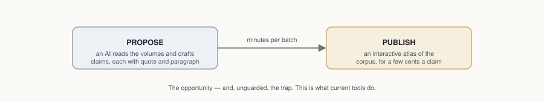
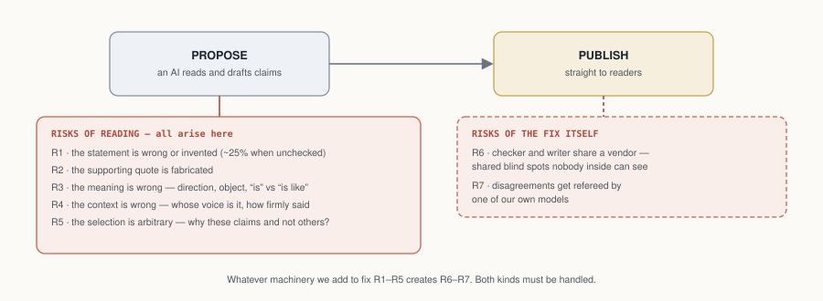

# Trust, Measured: Verification-First AI Knowledge Extraction for Interpretive Corpora, Demonstrated on Jung's *Collected Works*

**Damian Spendel**
*AI use disclosure — tools and roles: Claude Opus 4.8 (extraction), Claude Fable 5 (verification), Gemini 3.1 Pro (cross-vendor audit), orchestration via Claude Code, all under the author's direction. Detail in §6 and the Authorship Note.*

*v1.2 — 28 July 2026 · DOI: [10.5281/zenodo.21631523](https://doi.org/10.5281/zenodo.21631523) · Artifact: [symbolicworld.observer](https://symbolicworld.observer) · Repository: [github.com/damianspendel/symbolic-world](https://github.com/damianspendel/symbolic-world), release `v1.0.0`*

---

## Abstract

AI makes it cheap to turn twenty volumes of an author's writing into a queryable map of claims. Unguarded, it also makes it wrong: language models extract knowledge-graph facts at 30–66% accuracy and hallucinate 11–57% of citations in deployed systems. This paper contributes, primarily, a methodology for doing it trustworthily, and secondarily the artifact that demonstrates it: a knowledge graph of C. G. Jung's *Collected Works* (241 concepts and symbols, 648 relations, 673 references — sampled for claim salience, not exhaustive coverage (§7) — each anchored to a numbered paragraph with a verbatim quote of at most 25 words, and each typed by voice: the author's own claim, doctrine he reports, or a source he quotes). The method treats extraction as risk management: seven named risks, a mitigation in the pipeline for each, and an experiment measuring each mitigation. Every published claim passed a deterministic quote check and review by a model from a different family than the proposer; a different vendor's audit covers 68% of references (405 of CW 14's 413, sampled elsewhere) and is a mandatory pre-merge step for all new batches. Every interpretive claim ships with its evidence and with live channels for any reader to dispute or confirm it (one structural ordering edge — albedo precedes rubedo — carries no citation by design). What we can state: fabricated quotations are excluded within the checker's validated operating assumptions; in the evaluated samples, audits across two vendors upheld structural errors at 1–2% and fixed them; the voice class carries a corrected rate of 10.3% with a residual no current audit can bound (the hard cases defeat both vendors alike) — human verification, now planned, is the missing floor. A pilot replication on a second, public-domain corpus (James's *The Varieties of Religious Experience*) shows the same risk profile — structural corruptions caught at high rates, voice the shared weak axis — which is encouraging but not yet demonstration; the replication ships as a complete package. All error rates, corruption seeds, and adjudications are published with the artifact, along with the mechanisms a reader needs to check any claim against the book.

## 1. Opportunity

Every field has corpora like this: twenty volumes of an author arguing, quoting, and reporting, in which what the author *said*, on *whose authority*, at *exactly which place*, is the scholarly currency. Law has its judgments, philosophy its systems, history of science its debates. Our running example is C. G. Jung's *Collected Works*: twenty volumes of densely cross-referential prose in which the same symbol (Mercurius, the lion, salt, Luna) carries systematically different meanings by context and authority. The digital tools that exist are lexical: the [ARAS concordance](https://aras.org/concordance) indexes word occurrences; [Princeton's digital edition](https://press.princeton.edu/books/ebook/9780691255194/the-collected-works-of-c-g-jung) searches full text. But no resource answers the question a reader actually has: *what does Jung say the green lion **is**, and on whose authority?*

Large language models make the answer look easy, and cheap: an AI reads the volumes, drafts the claims, and a public atlas appears for pennies per claim (Figure 1).



*Figure 1 — The opportunity: let the machines carry the mechanical load. Unguarded, this is also exactly what current tools do; the rest of this paper is about why that is not good enough, and what to do instead.*

The paper follows the shape of the work: risks (§2), their documentation in the literature (§3), a mitigation per risk (§4), a measurement per mitigation (§5–6), the residue (§7), the boundaries (§8), and the imperatives (§9). One design choice runs through everything: the trust chain is built to end in humans, not models, because a chain of models, however cross-checked, cannot certify itself. Honest status today: the machine part is complete and measured; the human part is live as channels, with accumulated human verification still small.

## 2. Risks

Reading is where the danger is. When a model turns prose into claims, seven things can go wrong, five in the reading itself and two in any machinery you build to catch them (Figure 2):

- **R1 — the claim is wrong.** The model asserts something the text does not say — even, often, while quoting it accurately: a real quote can carry a false claim.
- **R2 — the evidence is fabricated.** The supporting quotation itself does not exist in the cited paragraph. Distinct from R1: this is about the quoted words, not the claim built on them — and unlike R1 it is mechanically checkable.
- **R3 — the meaning is wrong.** Right ingredients, wrong dish: direction reversed, wrong object, "is" where the text says "is like".
- **R4 — the context is wrong.** The claim is real but the *voice* is misassigned: the author's own view (*author-asserts*), doctrine the author reports (*author-reports*), or a source the author quotes (*author-quotes*), and how firmly it is said. (In Jung: is this his psychology, or the alchemists' doctrine he is describing?)
  *Voice, defined:* a voice label answers "who is the source of this claim, and what is the author's commitment to it?" — a coarse-grained projection of attribution annotation (PDTB/PARC: source + introducing cue) and source-relative factuality (FactBank, human κ = 0.81). The full decision procedure, edge-case rulings, and worked examples are a published annotation protocol (`docs/ANNOTATION_PROTOCOL.md`); the hard case, sympathetic reportage, is that literature's nested partial-commitment problem.
- **R5 — the selection is arbitrary.** Why these claims and not others? A different run might paint a different picture.
- **R6 — the checkers share blood with the writer.** If proposer and verifier come from one vendor, they may share blind spots that no one inside the loop can see.
- **R7 — the referee is one of ours.** When checkers disagree, some judge must rule, and if that judge is also our model, it is marking its own homework.



*Figure 2 — The same naive pipeline, with its risks made visible. R1–R5 arise at the reading step; R6–R7 arise from the fix itself.*

## 3. Related Work

The risks above are documented, not hypothetical:

**LLM KG extraction.** [KGGen](https://papers.neurips.cc/paper_files/paper/2025/file/2b368455e832d2b1a60bcad8c4c6481f-Paper-Conference.pdf), GraphRAG, OpenIE establish unverified accuracy baselines (30–66%), and citation-hallucination rates of 11–57% persist in deployed systems ([survey](https://arxiv.org/html/2508.15396v1); ["Cited but Not Verified"](https://arxiv.org/pdf/2605.06635)); [schema-aware triple verification](https://arxiv.org/pdf/2604.04190) and prover–skeptic [dialogue approaches](https://arxiv.org/pdf/2603.06974) add post-hoc verification. We differ in making verification a *mandatory publication gate*, grounding it in the full source paragraph, and calibrating the verifier itself with seeded corruptions.

**Attributed generation.** Verbatim-evidence systems (FullCite / [structured inline citation](https://arxiv.org/html/2606.07130), Quote-Tuning) enforce quotation at generation time; we enforce it at dataset level as a hard deterministic check, independent of any model.

**LLM-as-judge reliability.** [Self-preference bias](https://www.researchgate.net/publication/385353198_Self-Preference_Bias_in_LLM-as-a-Judge) (measured −38% to +90%) and [debiasing work](https://arxiv.org/pdf/2508.09724) motivate our hard constraint that proposer and verifier come from different model families; our contribution here is applying that technique to the verification gate itself and publishing the resulting sensitivity/specificity.

**Industry practice.** Production extraction pipelines converge on the same skeleton independently: schema-first design, typed mechanical validation with human escalation carrying the best-effort extraction ([production document-pipeline lessons](https://medium.com/alan/lessons-from-running-an-llm-document-processing-pipeline-in-production-33d87f99cdb1)), continuous calibration of automated judges against sampled expert judgment ([HITL evaluation practice](https://www.braintrust.dev/articles/best-human-in-the-loop-llm-evaluation-platforms-2026)), and verification loops with measured diminishing returns after ~2 rounds ([verification-loop patterns](https://timjwilliams.medium.com/llm-verification-loops-best-practices-and-patterns-07541c854fd8)). Dedicated KG fact-verification agents ([AgentKGV](https://arxiv.org/html/2607.09092)) treat verification as a first-class subsystem. Our pipeline is the documented, measured instance of this consensus applied end-to-end to an interpretive humanities corpus: orthodox in its skeleton (cross-model judging, staged validation, audit artifacts); its distinctive choices are publication-gating (a policy, not a technique) and applying seeded-corruption calibration to the verification gate itself. Voice typing adapts a mature NLP tradition — event factuality and attribution annotation ([FactBank](https://link.springer.com/article/10.1007/s10579-009-9089-9), the [Penn Discourse Treebank](https://catalog.ldc.upenn.edu/LDC2019T05) attribution layer, [subjectivity and private states](https://link.springer.com/article/10.1007/s10579-005-7880-9)) — to a scholarly-publication setting; our "sympathetic reportage" residual is that literature's nested/partial-commitment attribution problem, and its human inter-annotator agreement figures are the natural benchmark for our planned human tier. Seeded corruption likewise descends from perturbation-based evaluation ([FEVER](https://arxiv.org/abs/1803.05355), [CheckList](https://arxiv.org/abs/2005.04118)).

**Positioning at a glance.**

| Dimension | Existing work (cited) | This methodology |
|---|---|---|
| What gets verified | sampled/selected outputs: [PhilKG](https://openreview.net/forum?id=yvk5HRVGQr) reviews a selection; [schema-aware verification](https://arxiv.org/pdf/2604.04190) and [prover–skeptic dialogue](https://arxiv.org/pdf/2603.06974) verify post hoc | every published claim, as a publication gate |
| Verifier independence | same model or a stronger same-ecosystem model ([PhilKG](https://openreview.net/forum?id=yvk5HRVGQr)); self-judging bias documented by [self-preference studies](https://www.researchgate.net/publication/385353198_Self-Preference_Bias_in_LLM-as-a-Judge) | different model family at the gate; different **vendor** at the audit |
| Is the verifier itself measured? | perturbation testing exists for classifiers ([FEVER](https://arxiv.org/abs/1803.05355), [CheckList](https://arxiv.org/abs/2005.04118)) but is rarely applied to the verification gate of an extraction pipeline | seeded-corruption calibration of the gate, with published catch rates and CIs |
| Evidence granularity | citation- or document-level attribution ([citation-generation systems](https://arxiv.org/html/2606.07130); [hallucination surveys](https://arxiv.org/html/2508.15396v1)) | verbatim quote anchored to a numbered paragraph, mechanically checked |
| Whose claim is it? | attribution/factuality annotated in linguistic corpora ([FactBank](https://link.springer.com/article/10.1007/s10579-009-9089-9), [PDTB](https://catalog.ldc.upenn.edu/LDC2019T05)) but untyped in KG extraction ([KGGen](https://papers.neurips.cc/paper_files/paper/2025/file/2b368455e832d2b1a60bcad8c4c6481f-Paper-Conference.pdf)) | voice-typed (asserts / reports / quotes), hedges demoted |
| Error reporting | aggregate accuracy ([KGGen](https://papers.neurips.cc/paper_files/paper/2025/file/2b368455e832d2b1a60bcad8c4c6481f-Paper-Conference.pdf); [RAG vs GraphRAG](https://arxiv.org/pdf/2502.11371)) | per-risk residuals, published adjudications, public dispute log |

**What we borrowed.** The reference format adapts the assertion/provenance/publication-info anatomy of [nanopublications](https://arxiv.org/pdf/1809.06532) (a native serialization is planned). Nanopublications have seen almost no humanities uptake[^npuptake]; this project is evidence that they deserve consideration as a publishing form for the humanities: the atomic unit of a nanopublication (one claim, its exact source, who stands behind it) matches what a humanities footnote has always tried to be, and the voice dimension interpretive corpora add fits naturally in its provenance graph. And the voice-typing treats provenance as *epistemic stance* in the sense of [provenance-enhanced statements](https://arxiv.org/html/2606.15246) (worked examples of both borrowings: Appendix B): our stubborn "sympathetic reportage" residual — passages where Jung reports another tradition's doctrine *and* half-adopts it, so the claim belongs fully to neither voice — is precisely their claim-in-permeation between cognitive worlds (and an instance of [Drucker's argument](https://www.digitalhumanities.org/dhq/vol/5/1/000091/000091.html) that humanities "data" is better understood as *capta* — taken, interpreted — than given). Two neighbors define the space. [PhilKG](https://openreview.net/forum?id=yvk5HRVGQr) builds a 140K-node graph from the Stanford Encyclopedia of Philosophy with LLM extraction and a stronger model reviewing *selected* outputs; the contrast is instructive on three axes: PhilKG reviews a selection, we gate every published claim; PhilKG's independence comes from a capability tier (a stronger model from the same ecosystem), ours from vendor diversity; and PhilKG validates its judge on 20 sampled articles[^philkg] (its reported 48.5% citation-extraction accuracy measures extraction, not checking — the comparable figure for us is the audits' upheld-error rate, not the string matcher), where our quote layer is deterministic (verbatim anchoring), our verifiers are calibrated on n=200 with published confidence intervals, and a second vendor re-audited a full volume. The nearest in spirit is the [Darshana Graph](https://arxiv.org/abs/2606.18222), whose author names a randomly sampled precision evaluation "the most valuable immediate extension" of that work; this paper operationalizes exactly that extension, with the caveat that our annotators are so far models from two vendors rather than multiple humans (human in the loop live as a channel, §8). To our knowledge, no knowledge graph of Jung's Collected Works previously existed[^nojungkg]; the ARAS concordance and Princeton's digital edition are search, not relations.

## 4. Mitigants

Each risk in §2 forced a step into the pipeline. Figure 3 shows the result: the two-box dream of Figure 1 with four inserted checks, plus practices for the two risks that don't fit in a box.


*Figure 3 — Steps 2–5 did not exist in Figure 1; each was inserted because a named risk forced it (green tags name the risk each step mitigates), and each is measured by the experiment chip above it (legend in the figure; details in Appendix A).*

**Table 1 — the pipeline, step by step, and the risk each step mitigates.**

| Step | What it does | Mitigates | What comes out |
|---|---|---|---|
| 1 · Propose | A proposer model reads a window of the corpus and drafts candidate claims, each with a verbatim quote and its anchor, typed *author-asserts / author-reports / author-quotes* | — (the risks arise here) | ~20 candidates per window |
| 2 · Quote check | Deterministic: the quote must appear in the cited passage as a letter-normalized, in-order, near-contiguous token run (bounded gaps absorb interleaved footnote markers; collage quotes rejected, canary-guarded) | **R2** | candidates with real quotes |
| 3 · Structure gate | A reviewer model **from a different family** reads the full passage: is the claim there, right way round, right object, no inflation of analogy into identity? | **R1 · R3** | SUPPORTED / PARTIAL + correction / WRONG |
| 4 · Voice gate | A second, narrow review: whose claim is it, and how firmly is it made? | **R4** | voice + hedge corrections |
| 5 · Second-vendor check | A model **from a different vendor** re-judges the batch, blind | **R6** | independent verdicts, disagreements adjudicated |
| 6 · Publish | Corrections applied; WRONG dropped and logged; provenance stamped; integrity tests + canaries; build **fails closed** on any unverified reference; readers confirm/dispute | backstop for all | the public artifact |

R5 (arbitrary selection) is mitigated by practice rather than a step (union-mining plus stability probing); R7 (self-refereeing) by publishing every ruling and the auditor's adversarial re-review of the referee.

Every batch's passage through these steps is committed to a **transaction ledger**, one commit per transition; the construction history is replayable and auditable commit-by-commit.

**The cross-vendor loop.** Beyond the per-batch check, the second-vendor auditor re-audits the published graph, and the machinery itself, **at every dataset release** (two full runs so far, E6 and E7; this is a release-gated commitment, not a background process): it judges samples blind (in two modes: under our rubric for comparability, or entirely in its own terms for independence), every disagreement is adjudicated against the source passage with the ruling logged, the auditor then **adversarially re-reviews the adjudicator's rulings** (the conflict-of-interest control), and finally it critiques our gate prompt itself for bias. Audit findings re-enter the same merge machinery as ordinary batch verdicts: there is no separate, weaker path into the graph.

## 5. Risk Measurement

(A note on numbering: R-numbers are risks and E-numbers are experiments; the sequences are unrelated, and Table 3 (§10) maps each risk to the experiment that tests its mitigation.) Every mitigant gets measured, by a small set of reusable experiment designs, none of them corpus-specific:

- **Retro-verification** (measures R1 in the raw). Run the gates over output that was published *without* them: how bad is unguarded extraction?
- **Seeded-corruption calibration** (measures the gates that mitigate R1, R3, R4). Deliberately break known-good entries (reverse a direction, swap an object, inflate an analogy, flip a voice), hide them among clean ones, and count what each gate catches: turns "we have a verifier" into "we have a verifier with a measured catch rate per error type."
- **Adversarial audit** (measures the residual of R1–R4 in the published graph). Instruct a reviewer to *break* each published claim: what survived the gates?
- **Independent re-extraction** (measures R5). Re-run the proposer blind on an already-mined window: is the selection stable or arbitrary?
- **Cross-vendor audit, two modes** (measures R6, and the audit instrument itself). A different vendor's model re-judges published samples, once under the full rubric (comparable) and once under a reduced rubric (less steered — full independence not yet achieved): shared blind spots, and whether the rubric steers verdicts.
- **Standing self-tests** (guard R2 permanently; backstop everything). Corruption canaries the validators must catch on every run, and the human confirm/dispute channels on every published claim.

Figure 3 pins each design to the pipeline step it measures (chips and legend). Results for the Jung case study are consolidated in Table 3 (§10); per-experiment details are in Appendix A.

## 6. Case Studies

### 6.1 Jung's *Collected Works*

**Corpus.** Paragraph records `{volume, §, text, page}` extracted mechanically from epub markup (§ numbers read from bracketed markers, strictly ascending; never inferred), with a §→Bollingen-page concordance. The corpus stays local; only ≤25-word verified quotes are published (legal basis: `docs/LEGAL.md`).

**Roles.** Proposer: Claude Opus 4.8 (Anthropic). Structure and voice gates: Claude Fable 5 (Anthropic, a different family from the proposer). Second-vendor auditor: Gemini 3.1 Pro (Google). Orchestration: Claude Code, under the author's direction. The graph built before the cross-vendor stage existed was audited retroactively, in a stratified sample under the full rubric (E6) and a full volume under a reduced rubric (E7), which is what validated promoting that check from experiment to pipeline stage; the cross-vendor check itself costs only ~a tenth of a cent per citation[^cost] (the ~ten-cent figure quoted elsewhere is the full pipeline), so there is no economic reason to leave it post-hoc.

**Schema.** Nodes `{id, type ∈ {Concept, Operation, Symbol, Figure, Substance, Motif}, label}`; edges `{subject, relation (open vocabulary, verbatim-faithful), object, references[]}`; references `{volume, §, quote, claim_type, source?, confidence, verified, verified_by, verified_date}`.

**Provenance honesty.** Two disclosures. First, verification dates for references gated before 2026-07-26 were batch-backfilled rather than recorded per-operation (the verification is real; the timestamps are reconstructions); since then, stamps are written by the operations they describe under a published policy (`docs/PROVENANCE.md`), and any post-verification edit to a reference triggers re-gating with stamp replacement (applied to all 18 quote repairs of 2026-07-28: re-gated 18/18 SUPPORTED). Second, no reported measurement yet has a human behind it; a human-adjudicated gold sample by the author is planned, and its absence is this paper's most important limitation.

**Instantiation.** The generic voice vocabulary becomes `jung-asserts` / `jung-reports-parallel` / `jung-quotes-source` (+ named source). Current state: **241 nodes · 648 edges · 673 references** across 479 distinct paragraphs of nine CW volumes; CW 14 covered end-to-end; 450 asserts / 162 reports / 61 quotes-source across ~55 distinct named sources (after normalizing name variants) plus a handful of traditional attributions; 85 hedged (medium-confidence) references; 100% gate-verified with per-reference verifier and date.

**The artifact.** The public Atlas ([symbolicworld.observer](https://symbolicworld.observer)) renders the graph in six typed regions with search and walkable citations. Every citation expands to its verification record (claim type, source, confidence, verifier, date, and a check-it-yourself pointer to the exact § and Bollingen page), so refutation needs only the printed edition and about two minutes. Two gated reader channels close the loop: **dispute** (a prefilled report to the public issue tracker; admissible disputes are re-judged with the objection attached; outcomes published in the verification log and linked from the edge) and **confirm** (reader confirmations enter the edge's public record as human-in-the-loop provenance). Accumulated upheld disputes above the published error bar would falsify the pipeline claim itself, not just individual edges.

**What the measurements say about Jung.** The residual error class maps a real property of the text: every model configuration, across two vendors, fails on the same passages, where Jung reports alchemical or Gnostic doctrine and half-adopts it. That blended voice is a finding about the *Collected Works*, not just about models (developed as Imperative 3, §9), and it marks the exact place where Jungian scholarship is needed.

### 6.2 Replication: James's *The Varieties of Religious Experience*

The pipeline was run on a second corpus (with one divergence a hostile review later found and closed: the replication's pre-checker initially lacked the elision bound and word cap, and two published references violated them — both repaired and re-gated 2026-07-28; CI now enforces the James rules on every push): William James's *Varieties* (1902, public domain; 1,277 anchored paragraphs), mining the Conversion and Mysticism lectures. Results: 40 candidates; 40/40 quotes passed the mechanical check; the structure gate returned 37/3/0 (one corrected, two dropped under the no-one-off-nodes rule); the cross-vendor check passed all 38 published edges; and a seeded-corruption calibration (n=60) measured the gate at **90% sensitivity (CI 77–96%) and 100% specificity**, with the per-class profile matching Jung's: structural corruptions at ceiling, **voice again the weak axis (7/10, vs Jung's 18/25)**. The risk profile is not a Jung idiosyncrasy; for authored interpretive prose, voice appears to be the shared weak axis. Because the corpus is public domain, this replication ships complete: raw text, anchored corpus, candidates, verdicts, graph, and calibration (`james/` in the repository; visual graph at [symbolicworld.observer/james.html](https://symbolicworld.observer/james.html)). Full detail: `docs/experiments/exp8_james.md` (E8). Two honesty notes: the miner's instructions carry the claim-typing lessons of the Jung pipeline (its 7.5% raw error rate measures a taught miner, not a naive one), and this is pilot scale (38 edges, per-class calibration n=10).


## 7. Residual Risks

Table 2 answers one question: **of the risks in §2, what remains after the mitigations of §4, measured by the experiments of §5 (details: Appendix A)?** (A 16-item assumptions register is published in `docs/ASSUMPTIONS.md`.)

**Table 2 — residual risks.**

| # | Risk | Mitigation in force | Evidence / data | Residual |
|---|---|---|---|---|
| R1 | **Wrong claims** | structure gate (E1b-calibrated) | E2: 0/30 adversarial; E6/E7: 0 unsupported | none observed in evaluated samples |
| R2 | **Fabricated evidence** | deterministic quote check; 30-token elision bound; 7 canaries | 800/808 fragments exact substrings; 16 over-bound splices found by hostile review, repaired 2026-07-28 | eliminated within the stated bound |
| R3 | **Wrong meaning** | structure gate | reversal/object-swap caught 92–96% (E1b) | none observed in evaluated samples |
| R4 | **Wrong voice** | voice gate + graph-wide sweep | detector catches 70–80% on seeded flips; sweep fixed 10.3% | **unknown — the dominant surviving risk; the boundary cases defeat both vendors, so no defensible estimate exists without human verification** |
| i | **Shared-substrate risk** — proposer and verifier share one vendor; correlated blind spots invisible to both | **Tiered** (§4): family separation at the continuous mandatory gate (same vendor — the weaker form); vendor independence at the pre-merge check (all new batches) and at release audits for the earlier graph (E6–E7) | 0 unsupported edges (n=100); 1.0% upheld residual (n=407); both vendors miss the *same* voice items → text ambiguity, not shared blind spots | Low-moderate; one second vendor, and the mandatory gate remains single-vendor |
| ii | **Single translation** — quotes are Hull/Bollingen-bound | § anchors are edition-stable; documented as assumption #1 | — | German *GW* cross-check deferred (§8) |
| iii | **Salience sampling** — "strongest relations" per window, not exhaustive parse | Stability probe; union-mining; claim-coverage framing (§9, Imperative 6) | E4: independent re-extraction recovers core claims (37.5% strict pair overlap, theses stable); union batch: 13/20 candidates re-found existing pairs (ledger, b-union-2) | Tier-2 claims sampled, not complete |
| iv | **Calibration scope** — sensitivity measured only on four seeded corruption classes | Classes chosen from observed production errors; expanded to n=200 | E1b: 86% (CI 78–91%) / 93% spec; per-class 72–96% | Unknown error types unmeasured, by construction |
| v | **Single-paragraph judging context** — cross-paragraph claims can be mis-scored | Documented; flagged cases adjudicated case-by-case | E7: 2 of 10 moderate flags were cross-paragraph context cases (both-defensible) | Standing; a windowed-context gate would cost ~2× |
| vi | **Adjudication discretion** — the orchestrator (an Anthropic model) rules on disputes | All rulings published verbatim; adversarial cross-review by the second vendor | Unanchored cross-review (2026-07-28): the auditor endorses every upheld correction but rejects 6/10 (E7) and 3/7 (E6) convention-based rulings; the anchored 9/11 figure is retired | **Material and measured** — convention rulings do not survive independent review; human adjudication is the only full mitigation |
| vii | **Shared-rubric convergence** — agreement partly an artifact of handing the auditor our rubric | Rubric-free replication mode (E7) | Identical detection profile with and without rubric; 95% cross-mode verdict consistency | ≈ zero on tested classes at this n; untested classes unmeasured |
| viii | **Human in the loop still thin** — channels live, accumulated human data ≈ zero | Confirm/dispute channels shipped; community pilot planned (§8) | Channels e2e-tested; 0 reader confirmations to date (stated plainly) | The main open gap — see §8 |

## 8. Limitations

Where §7 quantifies what remains of the *named* risks, this section lists the boundaries the experiments never touched.

Coverage beyond CW14/CW12 is thin (eleven volumes untouched; the seven other sampled volumes sit at 1.5–3.9% of paragraphs cited). The relation vocabulary is open and long-tailed — 252 distinct relations over 648 edges, 200 used once — which limits queryability and is unevaluated at query level; a relation-family layer is the planned fix.  Human-in-the-loop verification is live as channels but thin as data. Generality is demonstrated only at pilot scale (38 edges, one second corpus). Next, in order: explicit permeation markers for sympathetic reportage — a dedicated annotation for claims that sit *between* voices, replacing the current workaround of picking the nearest voice and lowering confidence (concept in Appendix B); the community verification pilot ([`docs/ASSUMPTIONS.md`](https://github.com/damianspendel/symbolic-world/blob/master/docs/ASSUMPTIONS.md) §E); a native nanopublication serialization; a German *Gesammelte Werke* cross-check.

## 9. Imperatives

1. **Ensure extraction is verified: the checking is the product.** A quarter of unverified extractions were flagged by the gate (an alarm rate, uncorrected for the gate's own 93% specificity); after gating, adversarial audits find zero coarse structural errors — near-referent drift and the voice residual are Imperatives 2–3's subject.

2. **Know the two kinds of mistakes: machines only catch one well.** *Shape* mistakes (wrong direction, wrong object) are caught at 92–96% in calibration — with a caveat the calibration design imposes: the seeded object-swaps are random nodes from across the graph (coarse, highly detectable), while the structural errors production audits actually upheld are *near-referent drift* (Adam for Anthropos, filius unius diei for filius regius), a harder class the calibration has not yet seeded. The 92–96% is an upper bound on coarse errors, not a measurement of drift detection. *Voice* mistakes (who is speaking: Jung himself, or the alchemists he is describing) are caught only about three times in four. So nearly everything that slips through is a voice mistake. Like proofreading: the spellchecker catches spelling nearly perfectly; whether a sentence is sincere or sarcastic survives it.

3. **Voice is genuinely hard, for machines and probably for people.** "Sympathetic reportage" (doctrine Jung reports *and* half-adopts) resists a clean three-way label; every model configuration we tested, across two vendors, missed the same borderline items.

4. **Teach the miner: fold the gate's corrections back into its instructions, not its weights.** When the verifier corrects a batch ("you typed reported doctrine as Jung's own claim"), those corrections are folded into the *next* batch's extraction instructions as explicit rules and examples. The extraction model never changes; its briefing does.  The per-batch flag series runs 18.9 → 11.0 → 5.5 → 10.2 → 5.6% — trending down but not monotone, with batch age confounded by volume and subject matter: suggestive, not established. The controlled test (E9): on a held-out window, blind-gated, the taught miner was flagged at 15% vs the untaught miner's 35% — confound-free support at pilot scale (p ≈ 0.27 at n=20/arm).

5. **Specialize the checkers: one measured weak axis each.** A checker given five things to check does the obvious ones well and the subtle one poorly; given one thing, it does that one well. On the same 25 planted voice errors, the five-criteria generalist caught 18 and the single-axis specialist 20 — a modest, consistent advantage (the consolidated statistical caveat is stated once, in Appendix A under E5b). The four errors neither ever catches are the sympathetic-reportage boundary: a property of the text, not the prompt.

6. **Measure coverage in claims, not pages: the graph is accurate, not exhaustive.** It cites 34% of CW 14's paragraphs; independent re-extraction shows 37.5% strict pair overlap, and the reading that the core claims recur rests on a model's own post-hoc classification of the non-overlap, pending blind human coding (E4). The underlying reason: most paragraphs argue, illustrate, or amplify rather than assert a new relation. Like a topographic map, it is complete above a chosen prominence, not in every hill; union-mining lowers that threshold at ~$2 per window.

7. **Make trust inspectable.** Per-citation verification records, published error rates, self-testing validators, and live dispute/confirmation channels convert "trust us" into "check us."

## 10. Summary of Results

What can honestly be compounded, and what cannot. Two flag rates exist: 25.2% on the ungated backlog (Fable, cross-volume, all flags acted on) and 12.5% on the published graph (Gemini, CW 14 only, 4 of 51 flags upheld after first-party adjudication). They differ in grader, prompt, population, and adjudication discipline, so we do not present their ratio as a measured reduction; they are two measurements that point the same way. What the evidence supports: fabricated quotations are excluded within the validated operating assumptions of the deterministic quotation checker (letter-normalized matching, a stated elision bound, canary-guarded); coarse structural corruptions are caught at 92–96% in calibration, with realistic near-referent drift not yet calibrated and four drift errors found and fixed by audits; and the voice class has a corrected rate of 10.3% (E3) with an unknown residual — the boundary subpopulation defeats both vendors, so no point estimate is defensible until human verification exists.


**Table 3 — pipeline step · risk · mitigant · experiment · headline result (Jung), with the James replication (E8) alongside.**

| Pipeline step | Risk | Mitigant | Experiment | Result (Jung, CW) | Result (James, VRE) |
|---|---|---|---|---|---|
| 1 · Propose | R1 wrong/invented statements | never publish raw — everything below | E0 | unchecked extraction: ~25% flawed | taught miner: 7.5% raw (not comparable — see E8) |
| 1 · Propose | R5 arbitrary selection | union-mining; claim-coverage framing | E4 | 37.5% strict overlap between two vocabulary-primed runs; the benign-non-overlap reading is model-classified, pending human coding | — (not run) |
| 2 · Quote check | R2 fabricated quotes | deterministic verbatim match | canaries | fabrication excluded within the stated bound; canaries on every build | 38/38 pass post-repair (2 initially violated the bound) |
| 3 · Structure gate | R3 wrong meaning | independent model family reads the full paragraph | E1b | 86% caught (CI 78–91%) on coarse seeded errors; near-referent drift unseeded | 90% caught (CI 77–96%), same caveat |
| 4 · Voice gate | R4 wrong context | narrow specialist on the measured weak axis | E5 · E3 | sweep fixed 10.3%; specialist 80% vs 72% paired | voice-flips 7/10 — same weak axis |
| 5 · Second vendor | R6 shared blind spots | Gemini re-judges, full-rubric and reduced-rubric | E6 · E7 | 0 upheld-unsupported /100 (4–7 contested unanchored); 1.0–2.2% adjudicated residual /407 | 38/38 supported (pre-merge) |
| (refereeing) | R7 marking own homework | rulings published verbatim; unanchored second-vendor re-review | E6/E7 addenda | corrections all endorsed; convention rulings rejected 9/17 — R7 measured as material | — (no disputes arose) |
| 6 · Publish | whatever still got through | adversarial audit; evidence views; reader confirm/dispute | E2 · humans | 0 content errors in 30; human data early | published graph + full reproduction package |


## 11. Conclusion

What has this methodology actually produced? Judged dimension by dimension:

Accurate on what audits can see: across two vendors, upheld errors run 1–2%, none fabricated; the voice boundary is explicitly unmeasurable by current instruments and awaits human verification. The unguarded baseline was flagged at roughly one in four (an alarm rate). Complete only in a claimed and partially tested sense: within CW 14, re-extraction re-finds much of the core (with E4's caveats); for the eight thinly-sampled volumes (1.5–3.9% of paragraphs cited) no completeness claim is made at all. It is not comprehensive: one volume end-to-end, eight more touched, eleven untouched. It is inspectable, always, since every claim carries its evidence, verifier, and history, the construction replays commit by commit, and disputing takes two minutes and a book. General in design and promising at pilot scale: a second, public-domain corpus (James's *Varieties*) reproduced the same risk profile under the near-identical pipeline and ships as a complete reproduction package — encouraging, not yet established. And human-verified only thinly so far. The channels exist and are tested; the accumulated human record is the project's youngest and most important open front.

None of these dimensions is the point on its own. The point is that each now comes with a number or a mechanism where an adjective used to be: accuracy has an error bar, completeness has a tested definition, inspection has a button, and the gaps are stated in the artifact itself. The machines carried the mechanical load: proposing, checking, cross-checking, and the bookkeeping of every correction[^cost]. Human judgement has the last word, and, for the first time on this corpus, the tools to exercise it.

---

### Authorship note

Conception, direction, corpus provision, publication decisions, and final responsibility: **Damian Spendel**. Edge proposal: *Claude Opus 4.8* (Anthropic). Independent verification, audits, calibration runs: *Claude Fable 5* (Anthropic). Cross-vendor auditing, adjudication cross-review, and prompt-bias critique: *Gemini 3.1 Pro* (Google). Orchestration, tooling, experiments, drafting: *Claude Code* (Anthropic), under the author's instruction. Proposer/verifier family separation and the second-vendor audit tier are deliberate design constraints.

**Artifact availability.** Dataset, pipeline code, transaction ledger, all experiment inputs/verdicts/adjudications, and this paper: [github.com/damianspendel/symbolic-world](https://github.com/damianspendel/symbolic-world) (public; the issue tracker is the standing dispute channel described in §4). Live atlas: [symbolicworld.observer](https://symbolicworld.observer).

### Key references

- [KGGen (NeurIPS 2025)](https://papers.neurips.cc/paper_files/paper/2025/file/2b368455e832d2b1a60bcad8c4c6481f-Paper-Conference.pdf) · [RAG vs GraphRAG](https://arxiv.org/pdf/2502.11371)
- [Attribution, Citation, and Quotation: A Survey](https://arxiv.org/html/2508.15396v1) · [Cited but Not Verified](https://arxiv.org/pdf/2605.06635)
- [Self-Preference Bias in LLM-as-a-Judge](https://www.researchgate.net/publication/385353198_Self-Preference_Bias_in_LLM-as-a-Judge) · [UDA](https://arxiv.org/pdf/2508.09724)
- [Structured Inline Citation Generation](https://arxiv.org/html/2606.07130) · [Schema-Aware Triple Verification](https://arxiv.org/pdf/2604.04190) · [Prover–Skeptic KB Generation](https://arxiv.org/pdf/2603.06974)
- [Nanopublications](https://arxiv.org/pdf/1809.06532) · [Provenance-Enhanced Statements](https://arxiv.org/html/2606.15246)
- [KGs in Libraries & Digital Humanities](https://arxiv.org/abs/1803.03198) · [ARAS Concordance](https://aras.org/concordance)

## Appendix A — Experiment details

**Risk 1 — raw AI extraction can't be trusted.** *Mitigation: never publish raw extraction. Test: measure how bad it actually is.*

**E0 — Retro-verification of ungated extraction (n=238).** Everything mined before the gate became mandatory was re-checked by the standard gate: 178 confirmed, 54 corrected, 6 edges deleted. That is a **25.2% flaw rate for unverified LLM extraction** on this corpus, consistent with public benchmarks[^benchmarks]. Dominant classes: voice conflation, identity overreach, referent drift, direction reversal; deletions included a spliced quote and a reversed symbolization.

**Risk 2 — the gate itself might not work.** *Mitigation: treat the verifier as an instrument and calibrate it; feed it deliberately broken entries, hidden among clean ones, and count what it catches. (The mechanical validators get the same treatment: five planted corruptions that must be caught on every test run.)*

**E1 — Verifier calibration by seeded corruption (n=40, seed 20260726, blind).** 20 intact controls + 20 corruptions (5 each: direction reversal, voice flip, object swap, identity overreach), quotes/paragraphs untouched so only the semantic gate is tested; production prompt; key withheld. Results: **specificity 20/20 (100%)**; sensitivity 15/20 (75%): **reversal 5/5, object swap 5/5**, overreach 3/5, **voice flip 2/5**. Missed voice flips were sympathetic-reportage cases (doctrine Jung partially adopts): genuinely ambiguous voice.

**E1b — Expanded calibration (n=200, seed 20260727, blind).** The per-class sample was expanded tenfold (25 corruptions per class + 100 intact controls; reversal corruptions restricted to directional relations: a design fix, since reversing a symmetric relation is not a corruption). Results with 95% Wilson intervals (per-class intervals uncorrected for multiple comparisons; and a design limit found by hostile review: object-swaps were seeded as uniformly random nodes and overreach as the literal token 'is-identical-to' — coarse, maximally detectable forms, whereas production errors are near-referent drift, which this calibration does not seed; re-calibration with realistic drift corruptions is planned alongside the human gold set): **sensitivity 86/100 (86%, CI 78–91%)**, **specificity 93/100 (93%, CI 86–97%)**; reversal **23/25 (92%)**, object-swap **24/25 (96%)**, overreach 21/25 (84%), voice-flip **18/25 (72%, CI 52–86%)**. Two honest consequences: (i) E1's n=5 voice-flip estimate (2/5) was noisy: the generalist's true voice baseline is materially higher, which **narrows the measured generalist–specialist gap** (consolidated caveat: E5b); (ii) the 100 controls are production references the same verifier previously passed, so 93% partly measures self-consistency rather than clean-item specificity (a human-anchored control set is the planned fix); several of the 7 flags are plausible nuance findings, one upheld and corrected in the graph. In conventional terms (labels are model-adjudicated pending the human gold set): treating "corrupt" as the positive class, E1b gives precision 86/93 = 0.92, recall 0.86, F1 0.89, with the confusion matrix TP=86, FN=14, FP=7, TN=93; the James calibration gives precision 36/36 = 1.00, recall 0.90, F1 0.95 (TP=36, FN=4, FP=0, TN=20). Full tables: `docs/experiments/exp1b_expanded_calibration.md`.

**Risk 3 — the finished graph might still contain errors.** *Mitigation: audit the published product in three independent ways: an auditor told to break each edge (E2), a graph-wide sweep of the weakest axis (E3), and an independent re-extraction to test whether the selection is arbitrary (E4).*

**E2 — Adversarial audit of published references (n=30, seed 20260725).** A differently-prompted reviewer instructed to *break* each edge: **0 content/direction/fabrication errors**; 4 disputes (13.3%), all attribution/modality refinements; all applied.

**E3 — Full-graph modality sweep (n=634, complete).** A narrow auditor checking only claim-type and hedge fidelity flagged **65/634 (10.3%)**: 50 claim-type corrections (including **5 in the reverse direction**: Jung's own theses mistyped as reportage, showing the audit is not a systematic deflation of the author's voice), 10 source corrections, 15 hedge downgrades, all applied. Flag rate by extraction age: **18.9% on the oldest edges → 5.6% on the newest**, and the three most recent production batches passed the gate **60/60**, evidence that gate corrections, fed back into extractor instructions, compound into first-pass precision. Two same-family measurements agree on the modality flag rate (audit 13.3%, sweep 10.3%); they share an instrument, so this is consistency, not independent convergence. (The calibration voice-flip miss rate is a detector property, not a prevalence.)

**E4 — Extraction stability probe (n=40 across two windows, blind).** Two already-mined windows re-mined independently with a fixed "20 strongest relations" budget (shared node vocabulary; prior triples withheld): strict unordered {subject, object} pair overlap with the graph was **7/20 (35%)** on CW14 §371–440 and **8/20 (40%)** on CW12 §332–420 (**37.5% combined**). Core theses recur near-verbatim across runs; non-overlap decomposes into complementary genuine edges (the windows hold 29–33 graph edges each, more than one 20-edge budget can cover), schema-shape variants of the same insight, and one case where the probe independently re-found an edge that adjudication had dropped on schema grounds. The graph is therefore a *stable curated map*, not an exhaustive parse; union-mining is the costed coverage upgrade.

**Risk 4 — the gate is weakest on one axis (voice).** *Mitigation: add a second, narrow reviewer that checks only whose claim it is and how firmly it is made; then calibrate that too.*

**E5 — Voice-specialist calibration (n=20, seed 20260727, blind).** Per-axis seeded corruption of post-sweep ground truth (6 voice flips, 4 hedge strips, 10 clean controls) run through the narrow stage-2 auditor: **sensitivity 80%** (voice flips **5/6 = 83%**, hedge strips 3/4), **specificity 10/10 (100%)**. Against the generalist's 40% voice-flip detection on the same error class (E1), this is a direct, controlled measurement of what we shorthand *semantic diffusion* in verification. Task decomposition is well documented for generation ([least-to-most prompting](https://arxiv.org/abs/2205.10625), [chain-of-thought](https://arxiv.org/abs/2201.11903), [plan-and-solve](https://arxiv.org/abs/2305.04091)); our contribution is not the decomposition idea but its seeded-corruption *measurement on the verification side*, replicated cross-vendor: same model, same paragraphs, scope narrowed from five criteria to one; detection improved on paired items (2/5→5/6 first-party; 2/6→4/6 cross-vendor) at zero false-positive cost. The expanded calibration (E1b) revises the generalist voice baseline upward to 72%, narrowing the measured gap (consolidated caveat: E5b below) — an honest downgrade the larger sample forced, and an example of the methodology auditing its own earlier claims. The two residual misses are the same sympathetic-reportage boundary cases identified by E1 and E3. **E5b (paired expansion, n=25+25) — the consolidated specialist caveat, stated once:** on E1b's 25 voice-flips the specialist caught 20/25 (80%, CI 61–91%) vs the generalist's 18/25 (72%); paired discordance 3:1 in the specialist's favor; direction consistent across five measurements including the cross-vendor replay; effect size modest (+8pp); not statistically resolved at these sample sizes. Treat the specialist advantage as consistently indicated, not established. Specialist specificity 24/25. Details: `docs/experiments/exp5b_specialist_expanded.md`.

**Risk 5 — proposer and verifier come from one vendor, and could share blind spots no one inside can see.** *Mitigation: bring in a different vendor's model as auditor, first with our grading scale, then (because the scale itself could bias it) with no scale at all.*

**E6 — Cross-vendor verification audit (n=100 production edges + calibration replays, Gemini 3.1 Pro).** A verifier from a different vendor (Google Gemini 3.1 Pro, temperature 0, same production gate prompt, blind to prior verdicts) audited a stratified sample of 100 published edges (strata: volume × claim type × extraction age): **89 SUPPORTED, 11 PARTIAL, 0 WRONG**; zero fabrications, reversals, or unsupported edges found by an independent vendor, and every disagreement confined to the attribution/referent-nuance axis the pipeline already identifies as its residual weakness. Adjudication of the 11 disagreements against the ground-truth paragraphs: **4 upheld** (two referent-precision errors, an edge anchored to a paragraph naming the *filius regius* rather than Rex and one naming Adam rather than Anthropos; one subject overreach, one referent demotion; all corrected, two near-duplicate edges removed), **5 both-defensible** (the sympathetic-reportage boundary), **2 not upheld** (one objection to ellipsis splicing permitted by the stated quotation rule, one strict-vocabulary reading). Because all sampled edges were published (the first-party verifier's marginal is degenerate), κ is uninformative here; the two-sided comparison comes from calibration replays: on the E1 corruption set Gemini scores **70% sensitivity / 95% specificity** (Fable: 75%/100%), with reversals and object swaps 5/5 and voice flips 2/5, **missing the same individual voice-flip items as Fable**, evidence that these items are intrinsically ambiguous rather than a vendor blind spot; on the E5 set the narrow voice brief lifts Gemini's voice-flip detection from 33% to 67% (Fable: 40% → 83%): **the semantic-diffusion effect replicates across vendors**. The orchestrator's dispute rulings were then adversarially reviewed by the cross-vendor model (9 AGREE / 2 PARTIALLY-AGREE / 0 DISAGREE); both partial agreements argued for stronger remedies than confidence demotion, and both were accepted (two referent retargets). Post-audit graph at the time of E6: 228 nodes, 608 edges, 633 references (the graph has since grown under the same pipeline rules; §6.1 states current counts). E6's headline is stated precisely: zero unsupported edges *under the shared rubric* (see residual risk vii).

**E7 — Reduced-rubric cross-vendor audit (n=407, full CW14 + calibration replay, Gemini 3.1 Pro).** E6's prompt-bias audit raised *shared-rubric convergence*: agreement measured under the first vendor's rubric partly reflects shared thresholds. E7 (originally described as rubric-free, relabeled after a code-level review) reduces the rubric: the strictness persona and prose claim-type definitions were removed, but — as a later code-level review established — the prompt still supplied a three-valued support enum, a four-valued severity enum, and directed the auditor at the project's attribution and confidence fields. It is a *reduced-rubric* replication, not a rubric-free one; a genuinely open-ended audit remains future work. Results: **356 supported / 47 partly / 4 no**; on the auditor's own severity scale, 350 none / 47 minor / 8 moderate / 2 serious. Adjudication of the 10 moderate+serious findings upheld **4 (1.0%)**: one misanchored edge deleted, one relation and one subject retargeted, one relation relabeled; none was a fabrication or reversal. Sensitivity to the adjudication itself: counting the 5 both-defensible rulings as half-errors gives 1.6%; as full errors, 2.2%; the 41 auditor-rated-minor flags were not adjudicated. Unlike E6, this adjudication initially received no auditor cross-review — a gap a later hostile review identified. The cross-review has since been run, **unanchored** (outcomes only, no rationales): the auditor agrees with all 4 upheld corrections and disagrees with all 6 convention-based rulings, so the honest residual is a range — 1.0–1.6% under the project's documented vocabulary conventions, 2.2% under the auditor's strict single-paragraph reading (E7 addendum, `docs/experiments/exp7_addendum_crossreview.md`; the six convention-dependent references now carry a `vocabulary_note` field). The calibration replay shows an identical detection profile across the two prompts (70%/95%, same per-class breakdown, same missed items) and 55/58 verdict consistency on doubly-audited references. Given how much rubric the 'reduced' prompt retained, the parsimonious reading is that the two prompts were operationally similar instruments — this narrows but does not discharge the shared-rubric concern (residual risk vii remains open pending a genuinely open-ended audit).

**Risk 6 — the referee of all these disagreements is itself a model from the first vendor.** *Mitigation: publish every ruling verbatim, and have the second vendor adversarially re-review the referee's rulings (it accepted 9 of 11 and successfully forced 2 stronger corrections; see E6). Full independence arrives with the human tier (§8).*

**Cost.** From production telemetry (~97K tokens/miner batch, ~56K/gate batch at $5/$25 and $10/$50 per MTok): ≈ **$0.09 per verified citation**, ≈ $0.12 including retro-verification, audit, and calibration overhead; total artifact cost ≈ $60–90.

[^npuptake]: The ~10.8M nanopublications catalogued by Kuhn et al. (2018) derive from DrugBank, GloBI, DisGeNET, WikiPathways, neXtProt, OpenBEL, LIDDI, and the Human Protein Atlas — all life-science datasets; we are aware of no published humanities nanopublication dataset.

[^cost]: Production telemetry (consolidated table: end of Appendix A): a mining batch consumes ≈83–97K tokens (proposer at $5/$25 per M tokens in/out), the structure gate ≈50–56K and the voice specialist ≈37K (verifier at $10/$50), the cross-vendor check ≈3K (≈$0.01/batch); ≈20 candidates per batch yields ≈$0.09–0.10 per verified citation at first pass, ≈$0.12–0.14 with calibrations and audits amortized. Total spend for the artifact plus its complete evaluation suite (E0–E8, code and paper audits): ≈$85–115. These figures are marginal API cost only; they exclude the author's and orchestrator's time (direction, adjudication, writing — roughly a person-week for this artifact).

[^nojungkg]: Based on searches (July 2026) of arXiv, digital-humanities venues, and Jungian digital resources; the nearest artifacts found are discussed above.

[^benchmarks]: 30–66% fact accuracy: [KGGen](https://papers.neurips.cc/paper_files/paper/2025/file/2b368455e832d2b1a60bcad8c4c6481f-Paper-Conference.pdf) and [RAG vs GraphRAG](https://arxiv.org/pdf/2502.11371); 11–57% citation hallucination: [survey](https://arxiv.org/html/2508.15396v1) and ["Cited but Not Verified"](https://arxiv.org/pdf/2605.06635). Both discussed in §3.

**What the audits missed — and what caught it.** The most instructive datum in this project is not a success. The cross-vendor efficacy audit of 2026-07-27 certified the quote checker as faithful while its elision path was still unbounded, and an E6 adjudication dismissed the second vendor's splice objection by appeal to the very rule that was defective. What found the defect was an adversarial, code-re-executing review the next day. The lesson is structural: sampled semantic auditing does not bound mechanical error classes — only adversarial re-execution of the code paths does — and a first-party adjudicator can wrongly overrule a correct objection (R7 materialized, in our own logs). Both failures are preserved in the published audit trail.

**E9 — Controlled teaching test (n=20 per arm, blind).** Two miners, identical model, same held-out window (CW 12 §111–180, never previously mined): one with minimal instructions, one with the correction-derived instructions; both candidate sets shuffled together and blind-gated by the same reviewer. Result: **taught 3/20 flagged (15%) vs untaught 7/20 (35%, including one WRONG conflation)** — a 2.3× reduction in the predicted direction, with the untaught arm failing on exactly the classes the instructions encode (hedges at high confidence, dream-specific claims generalized, miscast reportage). Fisher's exact p ≈ 0.27 at this n: controlled, confound-free support at pilot scale, not statistical proof. Details: `docs/experiments/exp9_teaching.md`.

**Cost, consolidated.**

| Level | Figure |
|---|---|
| Cross-vendor check alone | ≈ $0.001 per citation |
| First-pass pipeline (mine + both gates + check) | ≈ $0.09–0.10 per verified citation |
| Fully amortized (calibrations, audits, evaluation suite) | ≈ $0.12–0.14 per verified citation |
| Whole artifact + evaluation suite (E0–E8) | ≈ $85–115 — API cost only; excludes roughly a person-week of human time |

## Appendix B — Worked examples: nanopublication and epistemic stance

**A reference as a nanopublication.** Every reference in the dataset already carries the assertion / provenance / publication-info anatomy. One of ours, serialized:

```
:assertion {
  :blood  sw:synonym-of  :aqua-permanens .
}
:provenance {
  :assertion  prov:wasQuotedFrom  cw:vol14_par401 ;      # CW 14, §401
              sw:quote "one of the best-known synonyms
                        for the aqua permanens" ;         # verbatim, mechanically checked
              sw:claimType sw:jung-asserts .              # whose claim it is
}
:pubinfo {
  :  prov:wasGeneratedBy  sw:pipeline-v2 ;
     sw:proposedBy "claude-opus-4-8" ;
     sw:verifiedBy "claude-fable-5" ;  sw:verifiedDate "2026-07-27" ;
     sw:crossVendorAudit "gemini-3.1-pro" .
}
```

The transaction ledger (one commit per stage transition) plays the role of the trusty-URI immutability guarantee; a native serialization of the full graph in this format is planned (§8).

**Voice as epistemic stance.** The claim-type vocabulary is a stance annotation in the sense of the provenance-enhanced-statements (DEC) framework — each type places a claim in a different cognitive world:

| Paragraph evidence | claim_type | Cognitive world |
|---|---|---|
| "the experience of the self is always a defeat for the ego" (CW 14 §778) | `jung-asserts` | Jung's own assertoric layer |
| "why it was that Adam should have been selected as a symbol for the prima materia" (CW 14 §552) | `jung-reports-parallel` | the alchemists' belief-world, which Jung reports without owning |
| Orthelius on the quintessence "whose action may be compared with that of Christ" (CW 12 §512) | `jung-quotes-source` (source: Orthelius) | a named author's world, quoted |

The correspondence is diagnostic, not decorative: the pipeline's one systematically hard residual — *sympathetic reportage*, doctrine Jung reports and half-adopts — is precisely a claim in mid-permeation between the alchemists' world and Jung's own. Both verifiers, across two vendors, fail on exactly these items; the difficulty is a property of the text's epistemic structure. An explicit permeation marker — a fourth annotation meaning "this claim is in transit between voices: reported *and* partially adopted" — would replace the current workaround (nearest voice + lowered confidence) and is future work (§8).

[^philkg]: Figures from the PhilKG submission and its public review discussion ([OpenReview](https://openreview.net/forum?id=yvk5HRVGQr), accessed 2026-07-28): judge validation on 20 sampled articles of 1,786; citation-extraction accuracy 0.485.
